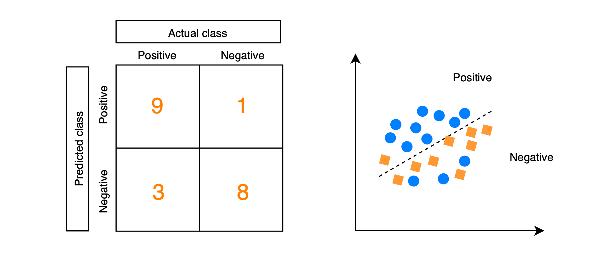
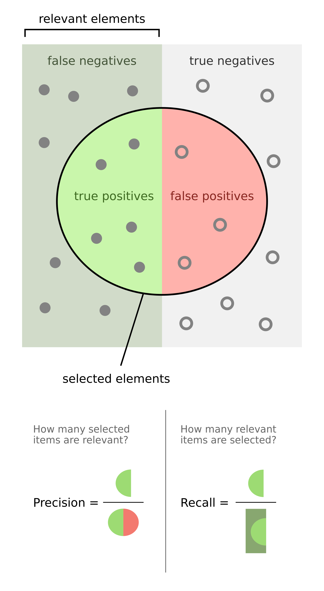

# Evaluation Metrics
Evaluation Metrics | Example code and own notes while taking the course "Intro to Machine Learning" on Udacity.

`accuracy = number of items in a class labeled correctly / all items in that class`

## Confusion matrix

## Precision & Recall

### Recall
_recall = true positive / true positive + false negative_

Out of all the items that are truly positive, how many were correctly classified as positive. Or simply, how many positive items were "recalled" from the dataset.

### Precision
_precision = true positive / true positive + false positive_

Out of all the items labeled as positive, how many truly belong to the positive class.

There is a good visual explanation about precision and recall on [Wikipedia](https://en.wikipedia.org/wiki/Precision_and_recall):
